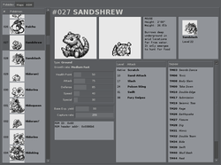
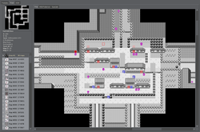
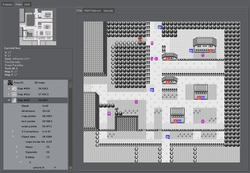
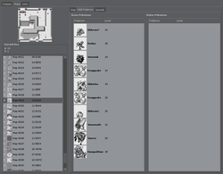
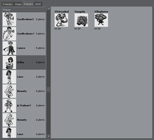
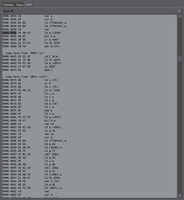

#  Pokanalysis 

Pokanalysis is a tool to analyse the first generation Pokémon ROMS… At least
Red and Blue US. It's only a viewer (no editing feature).

**Note**: this repository is old and and its dependencies depreciated a long
time ago. It's likely challenging to make it run again.

## Screenshots

<a href="img/pokedex-sandshrew.png"></a>
<a href="img/area-cerulean.png"></a>
<a href="img/viridian-city.png"></a>
<a href="img/safari-wild-pkmn.png"></a>
<a href="img/trainers-erika.png"></a>
<a href="img/disasm-pallet-script.png"></a>

## Current features

- Complete Pokédex
- Basic disassembler
- Main game area (Kanto) with merged or split maps
- Interior maps (houses, caves, etc.)
- Entering maps by clicking on warps/doors
- Wild Pokémon with their names and sprites
- Text of most of the signs
- Special items (hidden objects for example)
- Entities (people, trainers, items) and their default orientation
- Trainers list and teams

## Dependencies

- Python ~= 2.6
- PyGTK (GTK+ ~= 2.16)
- GCC (build only)

## Build

```shell
% make
% ./pokanalysis.py /path/to/your/pokemon/rom.gb
```

## TODO

- Map names
- Special items text and type
- Support more text (entities, special signs, …)
- More ROMS support (better addresses support)
- Collisions
- Search engine (wild Pokémon, items, …)
- Better maps GUI (previous/next, area position…)
- Editor?

## License

[ISC](https://www.isc.org/licenses/)
